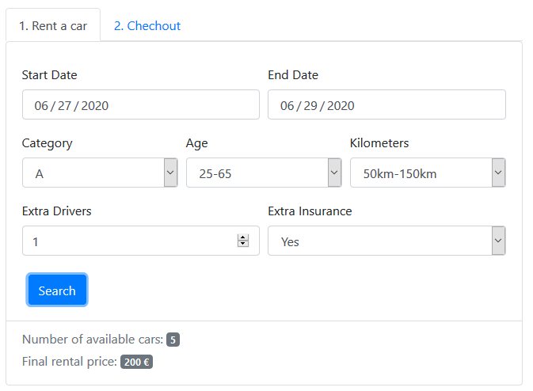

# "Car Rental"

## React client application routes

- Route `/home`: a home page that presents the list of cars and possible filters
- Route `/rent`: represent the activities realted to search available rent and checkout procedure
- Route `/history`: lists the reservations and the history of current or past rentals
- Route `/login`: shows a form to control user login procedure

## REST API server

- POST `/api/login`
  - request: parameters are username and password
  - response: body content is an object which contains id and name of the user
- POST `/api/logout`
  - response: clears token cookie
- POST `/api/filter`
  - request: filter object
  - response: returns list cars based on filter
- POST `/api/payment`
  - request: card data
  - response: true/false value (check validation)
- POST `/api/histories`
  - request: rent data as on object
  - response: an id after insert the record
- GET `/api/cars`
  - response: a list of cars
- GET `/api/cars/category/:category`
  - request: a category name
  - response: alist of cars based in the category
- GET `/api/brands`
  - response: a list of brands
- GET `/api/cars/:id`
  - request: an car id
  - response: an car object related to the requested id
- GET `/api/histories`
  - response: a list of all rents
- GET `/api/user`
  - request: username from the request object
  - response: a json which contains id and name of the user
- PUT `/api/rent/:rentId`
  - request: an rent id and a status in body
- PUT `/api/sync`
  - a API to sync rent and car tables

## Server database

- Table `car` - contains id, model, brand, categoryName, price, status
- Table `rent` - contains id, startDateTome, endDateTime, total, status, userId, carId, carCategory
- Table `users` - contains id, email, name, hash

## Main React Components

- `LoginForm` (in `LoginForm.jsx`): its main functionality is letting the user to login and let the user access the rent page and history page
- `Sidebar` (in `Sidebar.jsx`): it is separated into two sections, with some checkboxes in each to help users to filter cars
- `Header` (in `Header.jsx`): it helps users to navigate among the pages
- `Content` (in `Content.jsx`): this component shows a list of all cars in the company
- `ConfigForm` (in `ConfigForm.jsx`): this component represents some fields for users to check available rent option 
- `Checkout` (in `Checkout.jsx`): this component helps users to pay rent price
- `Category` (in `Category.jsx`): this component helps users to filter cards based on category
- `HistoryList` (in `HistoryList.jsx`): it shows the history of user rental, and also helps the user to cancel the current rental

(only _main_ components, minor ones may be skipped)

## Screenshot

## Test users

* mehrdad@trust.it, password (frequent customer)
* sia@trust.it, password
* john.doe@trust.it, password 
* admin@trust.it, password
* ivan@trust.it, password
